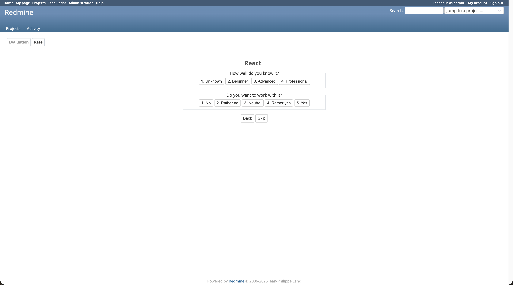
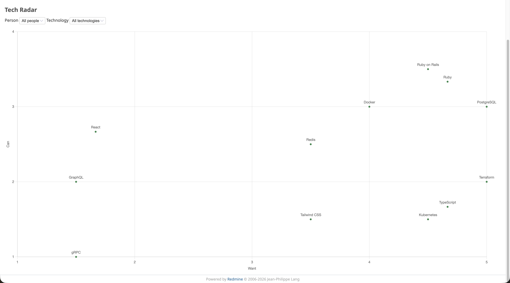

# Redmine Tech Radar

A Redmine plugin that lets developers rate technologies on two axes — how well they know them ("Can") and how much they want to work with them ("Want") — and lets sales see the result as a scatter chart.

The plugin is the MVP version of Renuo's internal Tech Radar, ported from a Google Sheets prototype to a Redmine plugin so it can reuse the existing user list and permissions.

## Screenshots

The rating view shows one technology at a time. Two clicks (one for "Can", one for "Want") save a rating and move on to the next unrated technology.



The evaluation view shows every rating on a single chart. Two dropdowns filter the chart by person or by technology.



## Requirements

- Redmine 6.1
- Ruby 3.4
- PostgreSQL

## Installation

Clone the plugin into Redmine's `plugins` directory:

```sh
cd /path/to/redmine
git clone https://github.com/renuo/redmine_techradar.git plugins/redmine_techradar
```

Install the plugin's gems and run its migrations:

```sh
bundle install
bundle exec rake redmine:plugins:migrate RAILS_ENV=production
```

Load the seed data (two roles and a starter list of technologies):

```sh
bundle exec rake redmine_techradar:seed RAILS_ENV=production
```

## Configuration

The seed adds two roles:

| Role | Permissions |
| --- | --- |
| `Tech Radar Entwickler` | View Tech Radar, Rate technologies |
| `Tech Radar Sales` | View Tech Radar |

Assign one of these roles to each user under **Administration → Users → *(user)* → Projects → New**: pick any project and check the appropriate role. The permissions are global, so the project is just a vehicle for the role assignment. Sales users see only the evaluation chart; developers also see the rating view.

The two permissions (`view_tech_radar` and `rate_technologies`) are global and can also be wired into your own custom roles under **Administration → Roles and permissions**.

The starter list of technologies lives in [`db/seeds.rb`](db/seeds.rb). Edit the array and re-run the seed task to add or remove entries — the seed is idempotent (`find_or_create_by!`), so existing technologies stay untouched.

## Usage

Open Redmine and click **Tech Radar** in the top menu.

- **Rate:** Pick a "Can" level and a "Want" level for each technology. The rating saves on the second click and the next unrated technology shows up. Use **Skip** to come back to a technology later, or **Back** to revisit the previous one.
- **Evaluation:** A scatter chart shows every rating. Without filters, each point is the average rating for one technology across everyone (the centroid). Filter by person to see one developer's ratings; filter by technology to see how every developer rated it.

## Development

Run the tests:

```sh
bundle exec rake redmine:plugins:test NAME=redmine_techradar RAILS_ENV=test
```

The plugin uses Minitest (the Redmine default) and Rails system tests with a headless Chrome driver. Tests live under [`test/unit`](test/unit), [`test/functional`](test/functional), and [`test/system`](test/system).

Style is checked with the Redmine RuboCop config:

```sh
bundle exec rubocop
```

## Copyright

© 2026 Renuo AG
